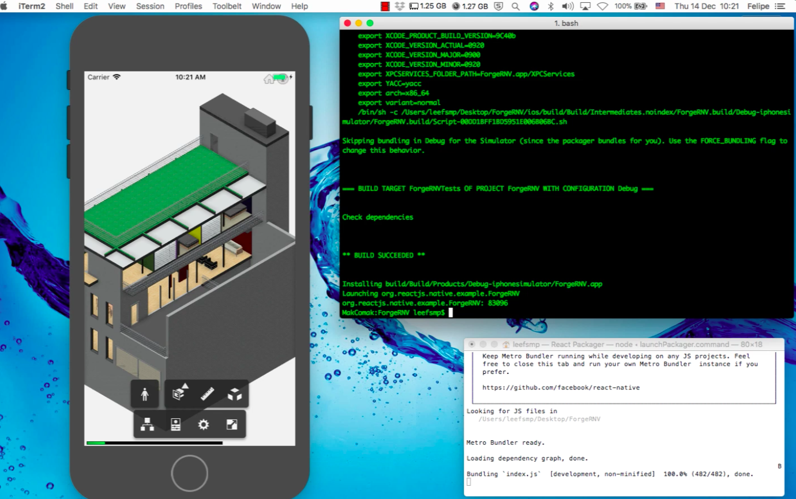

# About that sample

Forge Reac Native Viewer: Offline viewing demo with React Native and [Forge Viewer](https://developer.autodesk.com/api/model-derivative-and-viewer-cover-page/). 



## setup

 * npm install
 * read [React Native Getting Started Guide](https://facebook.github.io/react-native/docs/getting-started.html)
 * react-native run-ios / react-native run-android


## code

```
import StaticServer from 'react-native-static-server'
import React, { Component } from 'react'
import RNFS from 'react-native-fs'
import {
  StyleSheet,
  Platform,
  WebView,
  View,
  Text
} from 'react-native'

class ForgeViewer extends Component<{}> {

  constructor (props) {
    super (props)
    this.state = {
      uri: null
    }
  }

  getAssetsPath (platform) {
    switch (platform) {
      case 'ios':
        return RNFS.MainBundlePath + '/assets'
      case 'android':
        return RNFS.DocumentDirectoryPath
    }
  }

  componentDidMount () {
    const path = this.getAssetsPath (Platform.OS)
    this.server = new StaticServer(8080, path, {
      localOnly : true 
    })
    this.server.start().then((url) => {
      this.setState({
        uri: `file:///${path}/www/viewer.html`
      })
    }) 
  }

  render() {
    //const scalesPageToFit = (Platform.OS === 'ios') 
    const {uri} = this.state
    return (
      uri &&
      <WebView
        javaScriptEnabled={true}
        scalesPageToFit={true}
        style={styles.webView}
        scrollEnabled={false}
        source={{uri}}
      />
    )
  }
}

const styles = StyleSheet.create({
  webView:{
    backgroundColor: '#FFFFFF',
    flex: 1
  }
})

export default class App extends Component<{}> {
  render() {
    return (
      <ForgeViewer/>  
    )
  }
}

```